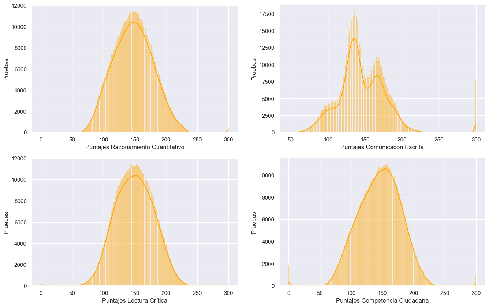
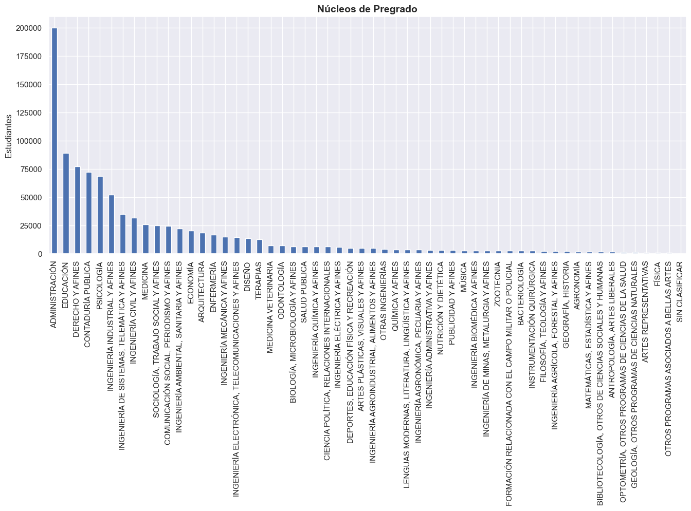

# EDA Pruebas Universitarias Colombia  SaberPro (2018-2021)

## Introducción  
*El ICFES (Instituto Colombiano para la Evaluación de la Calidad de la Educación) realiza anualmente las Pruebas Saber Pro para conocer el desarrollo de las competencias de los estudiantes que están por finalizar sus carreras Universitarias.* 

Se analiza un dataset que contiene el resultado de estas pruebas desde 2018 hasta el 2021 de todos los estudiantes que las realizaron en el país. Las variables **MOD_RAZONA_CUANTITAT_PUNT, MOD_LECTURA_CRITICA_PUNT, MOD_COMPETEN_CIUDADA_PUNT, MOD_INGLES_PUNT** representan el número de respuestas acertadas por cada estudiante en un rango de 0-300 y en las competencias de **Razonamiento Cuantitativo, Lectura critica, Competencia Ciudadana** e **Inglés**.

## Objetivos
* Observar el desempeño de los estudiantes en las pruebas. 
* Determinar que variables tienen mayor correlacion con un rendimiento positivo de la prueba. 

## Recursos implementados:
DataSource: https://www.datos.gov.co/Educaci-n/Resultados-nicos-Saber-Pro/u37r-hjmu  
Python Version: 3.9 
Packages: pandas, numpy,  matplotlib, seaborn

## Data Cleaning
- Se eliminan  variables no relevantes al analisís. 
- Se realiza gestión de datos nulos para variables categoricas, numéricas. 
- Se da formato a los datos del dataframe. 

## Datos atípicos
- Se grafica la distribución de las variables numéricas más representativas.
- Se usa metodología 3 Sigma para detección de outliers.

 

## EDA
- Se generan nuevas variables, correspondientes al desempeño general. 
- Se grafican las variables categoricas.
- Se grafican las variables numericas.

El dataset no muestra el desempeño de los estudiantes  en **razonamiento cuantitativo**, **lectura crítica** y **competencia ciudadana**. El icfes (Instituto Colombiano para la Evaluación de la Calidad de la Educación) establece una nota de 1 a 4. siendo 1 el más bajo y 4 la nota más alta. El desempeño se calcula con el puntaje (cantidad de preguntas respondidas correctamente) a través de la siguiente relación. 

| **Preguntas Correctas** | **Desempeño** |
|:-----------------------:|:-------------:|
|         185-300         |       4       |
|         150-184         |       3       |
|         116-149         |       2       |
|          0-115          |       1       |

*[fuente](https://www.icfes.gov.co/)*

Para el desempeño en el aréa de ingles va desde -A1, A1, B1.. hasta B2 siendo B2 el mas alto.
 
| **Preguntas Correctas** | **Desempeño** | **Desempeño** |
|:-----------------------:|:-------------:|:-------------:|
|         200-300         |       B2      |       4       |
|         180-199         |       B1      |       3       |
|         146-179         |       A2      |       2       |
|         123-145         |       A1      |       1       |
|          0-122          |      -A1      |      0.5      |

*[fuente](https://www.icfes.gov.co/)*

## Correlación de varibles

