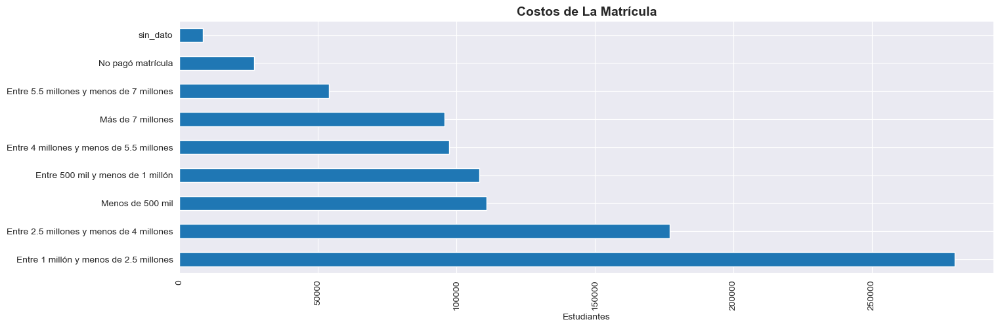

# EDA Pruebas Universitarias Colombia  SaberPro (2018-2021)

*El ICFES (Instituto Colombiano para la Evaluación de la Calidad de la Educación) realiza anualmente las Pruebas Saber Pro para conocer el desarrollo de las competencias de los estudiantes que están por finalizar sus carreras Universitarias.*

Se realiza un análisis estadístico de datos a los resultados de las pruebas saber Pro desde el año 2018 hasta 2021, con el fin de:

* Observar el desempeño de los estudiantes en las pruebas. 
* Determinar que variables tienen mayor correlacion con un rendimiento positivo de la prueba. 

1. Data Cleaning. 2. Datos atípicos. 

## Recursos implementados:
DataSource: https://www.datos.gov.co/Educaci-n/Resultados-nicos-Saber-Pro/u37r-hjmu  
Python Version: 3.9 
Packages: pandas, numpy,  matplotlib, seaborn

## Data Cleaning

Se analiza un dataset de 991577 registros. Las variables **MOD_RAZONA_CUANTITAT_PUNT, MOD_LECTURA_CRITICA_PUNT, MOD_COMPETEN_CIUDADA_PUNT, MOD_INGLES_PUNT** representan el número de respuestas acertadas por cada estudiante en un rango de 0-300 y en las competencias de **Razonamiento Cuantitativo, Lectura critica, Competencia Ciudadana** e **Inglés**.

- Se eliminan las variables no relevantes al analisís. 
- Se realiza gestión de datos nulos para variables categoricas, numericas. 
- Se da Formato a los datos del dataframe. 

## Datos atípicos

El maximo puntaje posible de las pruebas no debe superar el total de preguntas que tiene el examen (300), cualquier numero mayor a este en las variables de puntaje es un dato atípico. Se usa la regla de 3sixmas para la determinación de datos atípicos: *No se evidencian Outliers.* 

Se grafica la distribucion de las variables numericas más representativas.

