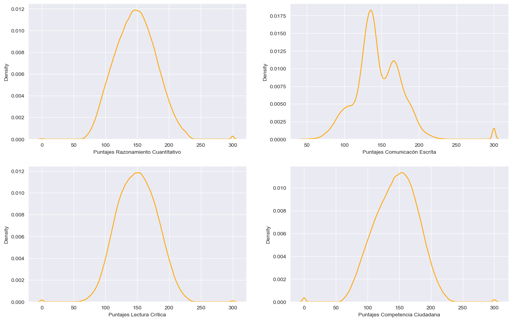
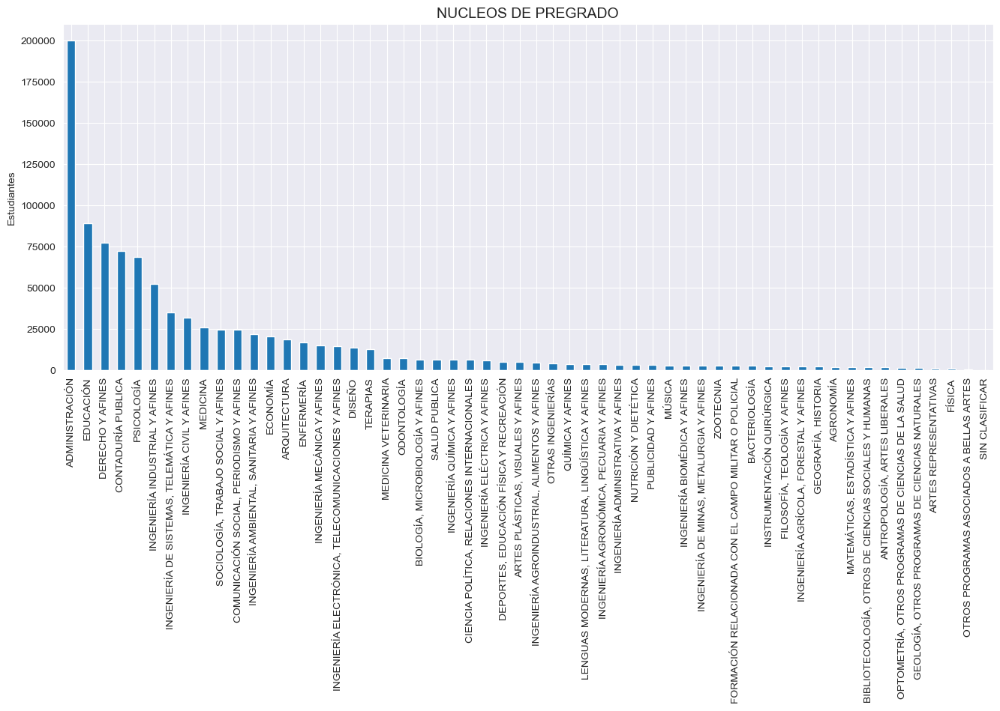
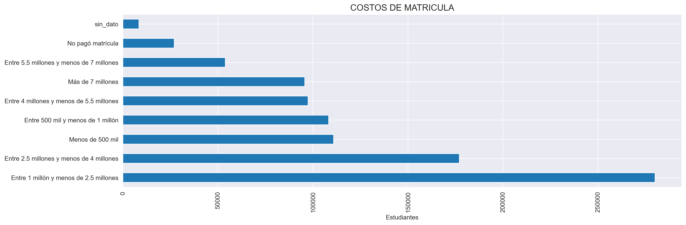
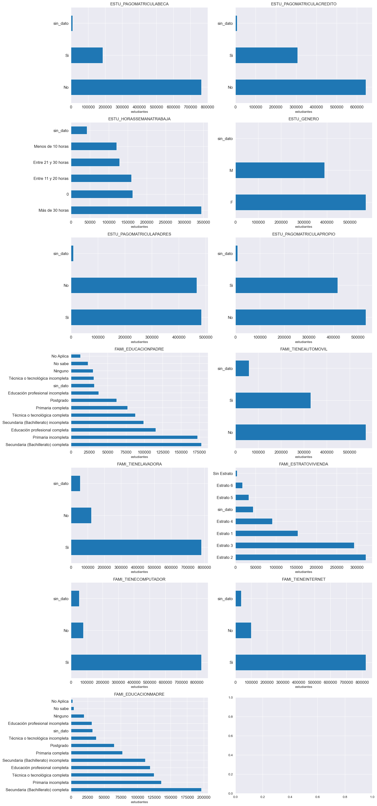

#  <h1>  p_03-001 Analísis de Datos a Pruebas Universitarias Colombia  SaberPro (2018-2021) </h1> 

## Introducción

*El ICFES (Instituto Colombiano para la Evaluación de la Calidad de la Educación) realiza anualmente las Pruebas Saber Pro para conocer el desarrollo de las competencias de los estudiantes que están por finalizar sus carreras Universitarias.* 

Se pretende llevar a cabo un análisis de datos a los resultados de estas pruebas desde 2018 hasta 2021 teniendo en cuenta el perfil socioeconómico de cada estudiante suministrado por el ICFES.  

Para el desarrollo del proyecto se realiza:

**Analísis Exploratorío de Datos EDA.** 
**Creación de DataWarehouse.** 
**Visualización de datos.**  

## Objetivos

* Establecer el desempeño de que tuvieron los estudiantes en las pruebas. 
* Generar analísis y visualizaciones del comportamiento de los datos en las pruebas. 
* Determinar que factores influyen más el desempeño de la prueba. 

## Recursos implementados:

Python Version: 3.9 
Packages: pandas, numpy,  matplotlib, seaborn

##  Analísis Exploratorío de Datos EDA

Se realiza un EDA a una tabla de datos [data_origen](https://www.datos.gov.co/Educaci-n/Resultados-nicos-Saber-Pro/u37r-hjmu) alojada en los repositorios de los datos abiertos del Gobierno de Colombia.  https://www.datos.gov.co/.  

### Limpieza de Datos
[preview](https://github.com/jospinoponce/EDA_ResultadoPruebasUniversitariasSaberPro/blob/main/Dataset/preview.md) de la tabla antes de realizar el EDA..  
- Se eliminan  variables no relevantes al analisís. 
- Se realiza gestión de datos nulos para variables categoricas, numéricas. 
- Se da formato, ajustes a los tipos de variables presentes en el proyecto.  

[Control de cambios](https://github.com/jospinoponce/EDA_ResultadoPruebasUniversitariasSaberPro/tree/main/Anexos/control_cambios) muestra detalladamente los cambios realizados en este proceso.
### Datos atípicos
- Se grafica la distribución de las variables numéricas más representativas.
- Se usa metodología 3 Sigma para detección de outliers.

 

## EDA
- Se generan nuevas variables, correspondientes al desempeño general. 
- Se grafican las variables categoricas.
- Se grafican las variables numericas. 

*variables categoricas*

### Interpretación de los datos

### Correlación de varibles

## DataWarehouse

## Concluciones

