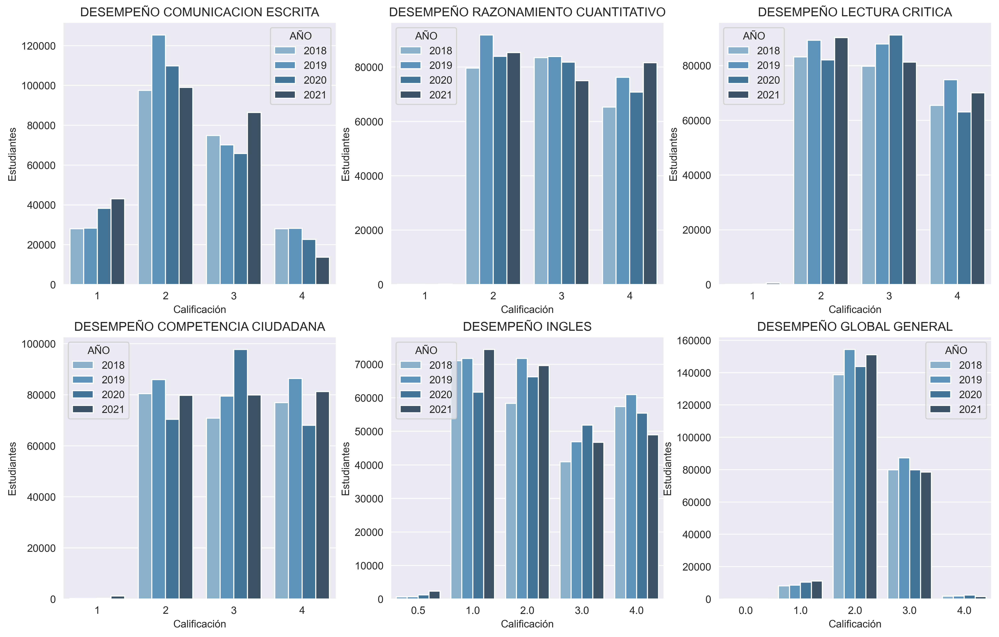

#  <h1>  Pj_03-001 Analísis de Datos a Pruebas Universitarias SaberPro (2018-2021) Colombia</h1> 

## Introducción

*El ICFES (Instituto Colombiano para la Evaluación de la Calidad de la Educación) realiza anualmente las Pruebas Saber Pro para conocer el desarrollo de las competencias de los estudiantes que están por finalizar sus carreras Universitarias.* 

Se pretende implementar herramientas de ciencia de datos para analizar los resultados que los estudiantes obtuvieron en las pruebas Saberpro desde 2018 hasta 2021 teniendo en cuenta el perfil socioeconómico suministrado por el ICFES con el fin de identificar patrones y variables que tengan incidencia con el desempeño de los alumnos en las pruebas.  

Para el desarrollo del proyecto se realiza:

**Analísis Exploratorío de Datos EDA.** 
**Creación de una Base de datos relacional.** 
**Visualización de los datos.**  
**Modelamiento predictivo ML.** 

## Objetivos

* Establecer el desempeño de que tuvieron los estudiantes en las pruebas. 
* Determinar que variables influyen el desempeño de las pruebas. 
* Generar a través de una visualización el  resultado del análisis de los datos. 

## Recursos implementados:

Python Version: 3.9 
Packages: pandas, numpy,  matplotlib, seaborn

##  Analísis Exploratorío de Datos EDA

Se realiza un EDA a una tabla de datos [data_origen](https://www.datos.gov.co/Educaci-n/Resultados-nicos-Saber-Pro/u37r-hjmu) alojada en los repositorios de los datos abiertos del Gobierno de Colombia.  

### Limpieza de Datos
[preview](https://github.com/jospinoponce/EDA_ResultadoPruebasUniversitariasSaberPro/blob/main/Dataset/preview.md) de la tabla antes de realizar el EDA.  
- Se eliminan  las variables que no son relevantes para el análisis.
- Se realiza gestión de datos nulos para variables categóricas, numéricas.
- Se da formato, ajustes a los tipos de variables presentes en el proyecto.  

[Control de cambios](https://github.com/jospinoponce/EDA_ResultadoPruebasUniversitariasSaberPro/tree/main/Anexos/control_cambios) muestra detalladamente los cambios realizados en este proceso.
### Datos atípicos
- Se emplea metodología 3 Sigma para detección de outliers.
- Se realiza gestión a los outliers presentes en el dataset.
- Se grafica la distribución de las variables numéricas más representatívas.

 

## Interpretación de los datos 
- Se generan nuevas variables, correspondientes al desempeño general de los estudiantes en las pruebas. 
- Se grafican las variables categóricas y numéricas. 

*Variables categoricas*

*Variables numéricas*

La variable desempeño determina una calificación en el desarrollo de las pruebas de 1 a 4. Donde ( 1: Bajo, 4:Alto). 
Para inglés  la calificación es (0.5: Bajo, 4:Alto)

### Correlación de varibles
- Generación de Matriz de ceros y unos para las variables categóricas. 
- Generación de Matriz de correlación

**Notebook del analísis exploratorio de los datos:** [report_EDA](https://github.com/jospinoponce/EDA_ResultadoPruebasUniversitariasSaberPro/blob/main/report_EDA.ipynb)

## Base de datos

## Visualización de los datos

## Concluciones
- La calidad de los datos es buena, los outliers no  .... 

